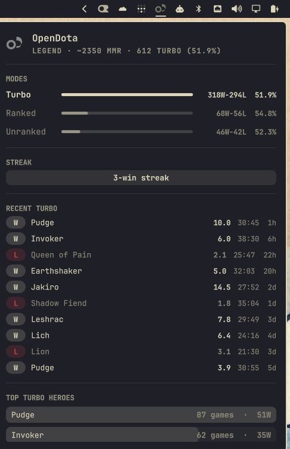

# opendota-bar

Dota 2 stats from OpenDota in the [Omarchy](https://omarchy.org/) status bar.

Shows rank and MMR estimate, per-mode (turbo / ranked / unranked) win rate,
current streak, recent turbo matches, and top turbo heroes. Turbo is the
headline queue because that's where most players spend their time, but the
plugin surfaces ranked and unranked alongside for context.



## Installation

The one-liner:

```sh
omarchy plugin add https://github.com/drc/opendota-bar --enable
```

That clones into `~/.config/omarchy/plugins/io.github.drc.opendota`,
validates the manifest, and enables the plugin in the bar (it will ask
which section to place it in).

Manual install:

```sh
git clone https://github.com/drc/opendota-bar \
  ~/.config/omarchy/plugins/io.github.drc.opendota
```

Add your OpenDota account id to `~/.config/omarchy/agents/opendota.json`:

```json
{
  "accountId": "83730627"
}
```

The id is the number in your OpenDota profile URL.

### Account id resolution order

The collector picks the account id from the highest-priority source available:

1. `--account-id` CLI flag (manual debugging)
2. `OPENDOTA_ACCOUNT_ID` env var
3. `accountId` field in `~/.config/omarchy/agents/opendota.json`
4. Local Steam install — most-recently-used entry in
   `~/.steam/steam/userdata/` or `~/.local/share/Steam/userdata/`,
   falling back to the entry with `AutoLogin = "1"` in
   `~/.steam/steam/config/loginusers.vdf`

So if you've signed into Steam on this machine, you may not need to
configure anything. Run `bin/collect --demo` to verify which id was
picked.

Enable the plugin by adding it to `~/.config/omarchy/shell.json`:

```json
{
  "bar": {
    "layout": {
      "right": [
        { "id": "io.github.drc.opendota" }
      ]
    }
  }
}
```

Restart the shell:

```sh
omarchy restart shell
```

## Removal

```sh
omarchy plugin remove io.github.drc.opendota
```

That deletes `~/.config/omarchy/plugins/io.github.drc.opendota`, calls
`omarchy-shell shell rescanPlugins`, and removes the plugin from the
running shell. Remove the matching entry from `~/.config/omarchy/shell.json`
to keep your bar layout clean. The plugin leaves no files outside its
plugin directory; the cached data at
`~/.cache/omarchy/opendota/` survives removal and will be reused if you
reinstall.

## Steam privacy

OpenDota only mirrors public Steam data. If your Steam match history is
private, the panel shows a notice and a rank-less profile; the rest of the
sections stay empty until you enable **Expose Public Match Data** under
**Dota 2 → Settings → Social** and wait ~5 minutes for OpenDota to refresh.

## Refresh cadence

- Automatic refresh (default 6 hours): walks the 100-match history and
  rebuilds per-mode buckets, top heroes, and streak. Editable in the settings
  panel.
- Opening the panel uses the cached record and does not contact OpenDota.
- Right-clicking the icon, pressing `R` or Enter, or using the IPC refresh
  command forces an immediate refresh.

## Interaction

- Click the bar icon to toggle the panel
- Right-click to force a heavy refresh
- `R` or Enter in the open panel also forces a refresh
- `Esc` closes, arrows scroll, `Tab` jumps to the next bar widget
- `omarchy-shell ipc call io.github.drc.opendota refresh` from a terminal works too

## Demo mode

The plugin supports a `demo: true` setting that emits synthetic data
without hitting OpenDota, useful for previewing the layout before your
real data is populated:

```json
{ "id": "io.github.drc.opendota", "demo": true }
```

Toggle it back to `false` (or remove the line) to use live data.

## Configuration reference

| key | type | default | meaning |
|-----|------|---------|---------|
| `accountId` | string | `""` | OpenDota account id. Empty = use the precedence order above (CLI > env > config > Steam auto-detect) |
| `refreshIntervalSec` | int | 21600 | Automatic refresh interval (seconds) |
| `recentMatchesCount` | int | 10 | Recent primary-mode matches shown |
| `topHeroesCount` | int | 5 | Top primary-mode heroes shown |
| `urgentStreakMin` | int | 3 | Lose streak length that flags the bar urgent |
| `urgentWinRatePct` | int | 45 | Primary-mode win rate below which the bar flags urgent (requires ≥20 games) |
| `maxPanelHeight` | int | 900 | Max panel height in px; always clamped to available screen space, so values larger than the screen simply use the full space |
| `demo` | bool | false | Emit synthetic demo data |

## Primary mode

The collector buckets matches into three modes — turbo, ranked, and
unranked — based on `game_mode` and `lobby_type`. The panel picks the
**primary mode** dynamically as whichever has the most games in the
sample: that mode drives the hero meta summary, the highlighted row in
the MODES breakdown, the recent-matches section, the top-heroes
section, and the urgent-win-rate threshold. For a primarily-turbo
player the panel reads as "612 Turbo (51.9%)" with turbo highlighted;
for a primarily-ranked player the same UI reads as "418 Ranked
(54.8%)" with ranked highlighted.

## Layout

```
manifest.json    plugin metadata + settings schema
Main.qml         data layer (Process + two timers)
Panel.qml        bar icon + popup
bin/collect      python3 collector; prints one JSON record
assets/          bar mark SVGs (tinted at render time)
```

## Attribution

Stats provided by the [OpenDota](https://www.opendota.com/) public API.
Dota 2 is a trademark of Valve Corporation. This project is not affiliated
with or endorsed by Valve.

## License

MIT
</content>
</invoke>
